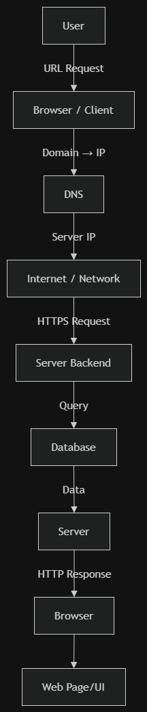

# How the Web Works: Request & Response Cycle (Instagram Example)

An overview of what happens under the hood when a user visits Instagram.

---

## The Request Journey Step-by-Step

1. **User:** Types `instagram.com` into the browser and presses **Enter**.
2. **Browser / Client:** Receives the input and initiates a lookup for Instagram's server address.
3. **DNS (Domain Name System):** Resolves the domain name `instagram.com` into its corresponding server **IP Address**.
4. **Internet / Network:** Sends an encrypted **HTTPS Request** over the network to Instagram's server IP.
5. **Server Backend:** Receives the request, processes it, and handles user authentication and permissions.
6. **Database:** The backend queries the database to retrieve relevant data (e.g., user feed, posts, images, and user profile data).
7. **HTTP Response:** The server packages the retrieved data and sends an **HTTP Response** back to the browser.
8. **Web Page / UI:** The browser receives the response, renders the HTML/CSS/JavaScript, and displays the Instagram UI to the user.
